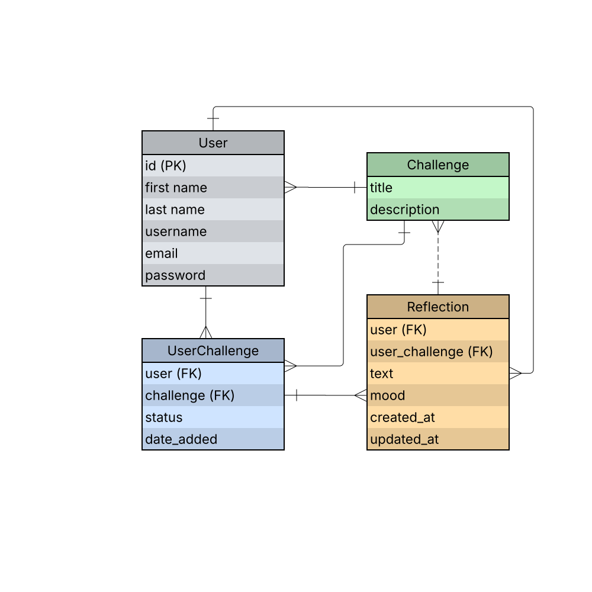

# Reachly Backend
This repository contains the backend of the Reachly web application, built with Django REST Framework.
It includes all the models, views, and API routes that power the core functionality of the Reachly web app from user authentication and daily challenges to reflections and progress tracking.

The backend serves as the main data source for the frontend React app, managing how data is stored, processed, and retrieved through secure RESTful endpoints.

## About Reachly
**Reachly** is a personal growth web app designed to help **introverts** step out of their comfort zone through **daily social and self improvement challenges**.  
Each user can choose a challenges, **track their progress**, and write **reflections** about their experiences, allowing them to build confidence, consistency, and mindfulness over time.  

## Tech Stack

- Python 3.13
- Django 5.2.7
- PostgresSQL
- Simple JWT
- Doocker

## Reachly frontend repository link:
[Reachyly Frontend (React)(https://github.com/CTRLD1/reachly-frontend)]

## ERD Diagram

---

## Routing Table
| Method | URL Pattern | View | Description |
|--------|--------------|------|--------------|
| GET | `/` | `Home` | Displays API welcome message |
| GET | `/challenges/` | `ChallengeIndex` | Returns a list of all challenges |
| GET | `/challenges/<int:challenge_id>/` | `ChallengeDetail` | Returns details of a specific challenge |
| GET / POST | `/userchallenges/` | `UserChallengeIndex` | Lists or creates user-specific challenges |
| GET / PATCH / DELETE | `/userchallenges/<int:userchallenge_id>/` | `UserChallengeDetail` | Shows, updates, or deletes a single user challenge |
| GET / POST | `/reflections/` | `ReflectionIndex` | Lists or creates user reflections |
| GET / PATCH / DELETE | `/reflections/<int:reflection_id>/` | `ReflectionDetail` | Shows, updates, or deletes a specific reflection |
| POST | `/login/` | `TokenObtainPairView` | Authenticates user and returns access/refresh tokens |
| POST | `/token/refresh/` | `TokenRefreshView` | Refreshes JWT access token |
| POST | `/signup/` | `SignUpUserView` | Registers a new user account |
| GET | `/profile/` | `ProfileView` | Returns logged-in user profile data |
| DELETE | `/profile/delete-user/` | `DeleteUser` | Deletes the logged-in user account |
| GET | `/progress/` | `ProgressView` | Returns user’s challenge completion progress |

